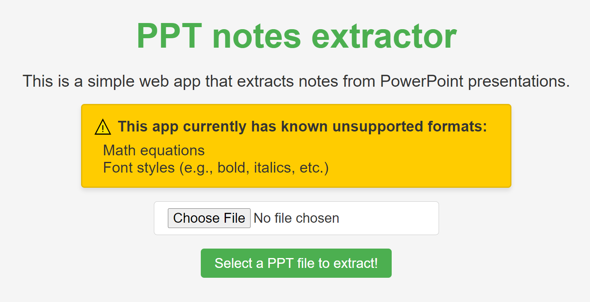

# PPT Notes Extractor

This is a simple web app that extracts notes from PowerPoint presentations. The app allows users to upload `.pptx` files and extract the notes embedded in the slides.

Live demo of the app:
[PPT Notes Extractor Web App](https://JC-comp.github.io/PPTNotesExtractor/)

## Features
- Upload `.pptx` files and extract slide notes.
- Display notes side by side for two different formats (text and HTML).

## Known Limitations
⚠️ **This app currently has known unsupported formats**:
- Math equations
- Font styles (e.g., bold, italics, etc.)
